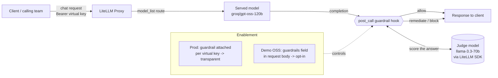
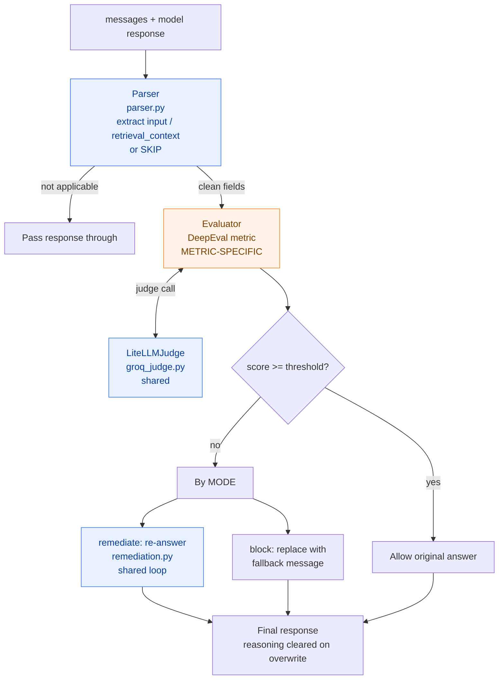
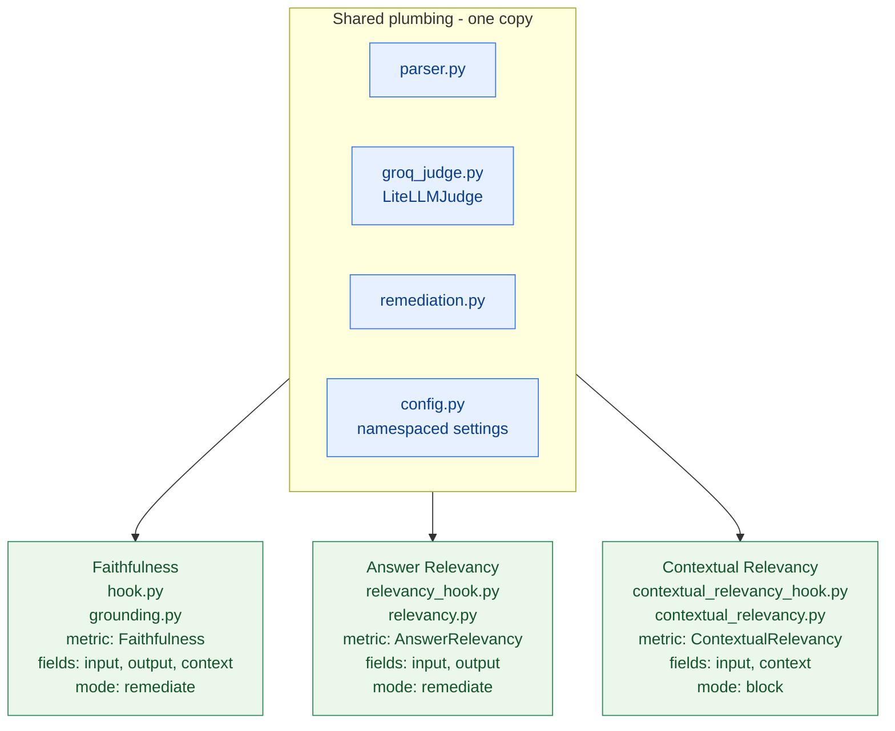
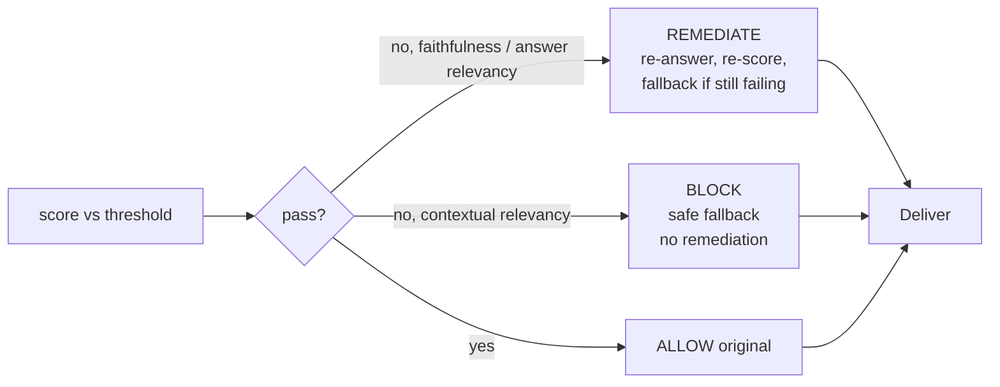
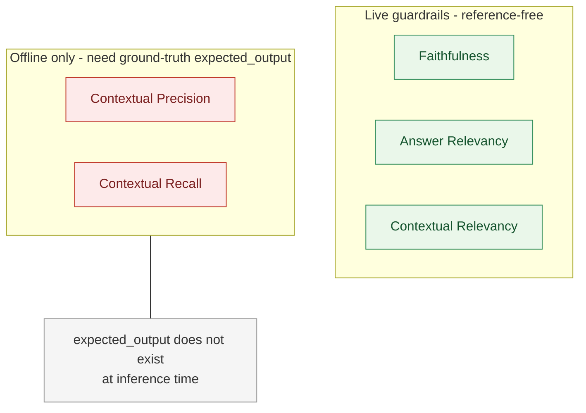

# Guardrails Architecture

Diagrams for the DeepEval-based LiteLLM guardrails. These render on GitHub and in
any Mermaid-aware viewer (VS Code preview, etc.).

---

## 1. Request lifecycle (where a guardrail sits)

The judge is a **separate** model reached through the LiteLLM SDK (not the served
model), so the guardrail never self-grades and the judge is swappable with one
env var.

---

## 2. Inside one guardrail (the reusable pattern)

Every guardrail is a thin orchestrator over four decoupled parts. Three are
shared; only the **evaluator** (the DeepEval metric) is metric-specific.

Blue = reused verbatim across guardrails · Orange = the one metric-specific piece.

---

## 3. The three guardrails (independent identities)

Each guardrail has its own class, `guardrail_name`, and config namespace, and is
registered as a **separate** entry in `config.yaml` — enable any combination
independently (per key in production).

---

## 4. Decision outcomes

**Why contextual relevancy blocks instead of remediating:** it grades the
*retriever*. Retrieval happened upstream in the caller's RAG pipeline, so
re-prompting the model cannot improve the score — the safe action is to block.

---

## 5. Live vs offline (scope of the DeepEval RAG metrics)

