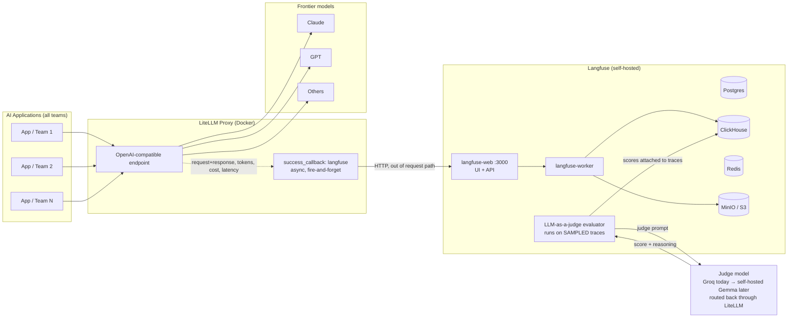

# Langfuse + LiteLLM: Gateway-Wide Observability & Evals

This guide sets up **self-hosted Langfuse** as the trace store and eval engine for
**all traffic** flowing through our LiteLLM proxy — no changes required from any
application team.

It covers:

1. [Architecture](#1-architecture)
2. [Installing Langfuse (self-hosted, Docker)](#2-installing-langfuse)
3. [Configuring LiteLLM to log to Langfuse](#3-configuring-litellm)
4. [How Langfuse captures the traffic](#4-how-traffic-capture-works)
5. [Setting up LLM-as-a-judge evals](#5-setting-up-evals)
6. [Data privacy notes](#6-data-privacy-notes)

---

## 1. Architecture



Key properties:

- **Contract-free**: the callback is configured once at the proxy level. Every
  request from every team is traced automatically, whatever format they send —
  they already speak OpenAI-format to LiteLLM and that is all that's needed.
- **Zero request-path impact**: logging is asynchronous (fire-and-forget). If
  Langfuse is down, user traffic is unaffected.
- **Log 100%, judge a sample**: tracing everything is cheap (storage only) and
  gives cost/latency/error dashboards for all traffic. LLM-as-a-judge runs only
  on a configurable sample (e.g. 10%) because it costs one extra LLM call per
  evaluated trace.
- **Judge behind the gateway**: the evaluator calls the judge model *through
  LiteLLM itself*, so swapping Groq for self-hosted Gemma later is a one-line
  LiteLLM model-config change — the eval system never notices.

---

## 2. Installing Langfuse

Langfuse v3 self-hosted = 6 containers (web, worker, Postgres, ClickHouse,
Redis, MinIO). The official docker-compose brings up all of them.

```bash
git clone https://github.com/langfuse/langfuse.git
cd langfuse

# IMPORTANT: change every default secret/password in docker-compose.yml
# (or use a .env file) before running anywhere shared:
#   NEXTAUTH_SECRET, SALT, ENCRYPTION_KEY, POSTGRES_PASSWORD,
#   CLICKHOUSE_PASSWORD, REDIS_AUTH, MINIO_ROOT_PASSWORD
# ENCRYPTION_KEY must be 64 hex chars: openssl rand -hex 32

docker compose up -d
```

Then:

1. Open `http://localhost:3000`.
2. Create the first user account (this becomes the instance admin).
3. Create an **Organization** (e.g. `company`) and a **Project**
   (e.g. `litellm-gateway`).
4. Go to **Project Settings → API Keys → Create new API keys** and save the
   pair: `pk-lf-...` (public) and `sk-lf-...` (secret). LiteLLM needs both.

> Production later: same stack via the official Helm chart on Kubernetes, with
> managed Postgres/ClickHouse/Redis/S3 if available. Nothing else changes.

---

## 3. Configuring LiteLLM

### 3.1 Networking (both stacks in Docker on one machine)

The LiteLLM container must reach the `langfuse-web` container. Easiest: put
LiteLLM on the Langfuse compose network, or use
`http://host.docker.internal:3000`.

Example LiteLLM compose service (see `litellm/docker-compose.example.yml`):

```yaml
services:
  litellm:
    image: ghcr.io/berriai/litellm:main-latest
    ports: ["4000:4000"]
    volumes:
      - ./config.yaml:/app/config.yaml
    command: ["--config", "/app/config.yaml", "--port", "4000"]
    environment:
      LITELLM_MASTER_KEY: ${LITELLM_MASTER_KEY}
      GROQ_API_KEY: ${GROQ_API_KEY}
      LANGFUSE_PUBLIC_KEY: ${LANGFUSE_PUBLIC_KEY}   # pk-lf-...
      LANGFUSE_SECRET_KEY: ${LANGFUSE_SECRET_KEY}   # sk-lf-...
      LANGFUSE_HOST: http://langfuse-web:3000        # or http://host.docker.internal:3000
    networks: [langfuse_default]

networks:
  langfuse_default:
    external: true   # network created by the Langfuse docker-compose
```

### 3.2 The two-line change in `config.yaml`

```yaml
litellm_settings:
  success_callback: ["langfuse"]
  failure_callback: ["langfuse"]   # errors get traced too
```

That's the entire integration. Full example in `litellm/config.example.yaml`,
which also registers a Groq model to serve as the eval judge.

> The stock `ghcr.io/berriai/litellm` image ships with the `langfuse` SDK. If
> you build a custom image and the proxy logs `langfuse not installed`, add
> `pip install langfuse` to the Dockerfile.

### 3.3 Verify

```bash
curl http://localhost:4000/v1/chat/completions \
  -H "Authorization: Bearer $LITELLM_MASTER_KEY" \
  -H "Content-Type: application/json" \
  -d '{"model": "groq-llama", "messages": [{"role": "user", "content": "hello"}]}'
```

Within a few seconds the request appears in Langfuse under **Tracing → Traces**
with input, output, model, token counts, cost, and latency.

---

## 4. How traffic capture works

- On every completed (or failed) request, LiteLLM's callback serializes the
  request messages, the response, model name, token usage, computed cost, and
  latency, and POSTs it to Langfuse **after** the response has already been
  returned to the caller. Events are batched and flushed in the background.
- **Attribution without a contract**: LiteLLM automatically tags each trace
  with the virtual key / team that made the call (use LiteLLM virtual keys per
  team — you likely already do for cost tracking). So dashboards can be sliced
  per team with zero app changes.
- **Optional, opt-in enrichment**: teams that *want* richer traces can pass
  standard LiteLLM metadata (`metadata.generation_name`, `trace_id`,
  `session_id`, `trace_user_id`, `tags`) in the request body. Purely optional —
  nothing breaks without it.
- **Per-team isolation (later, if needed)**: LiteLLM supports team/key-based
  logging, where each team's traffic goes to its own Langfuse project with its
  own keys.

---

## 5. Setting up evals

All in the Langfuse UI — no code.

### 5.1 Connect the judge model

**Settings → LLM Connections → Add connection**

- Adapter: **openai** (Groq and LiteLLM are both OpenAI-compatible)
- Recommended: point at **our own LiteLLM proxy** so the judge is just another
  gateway model:
  - Base URL: `http://litellm:4000/v1` (container-to-container) and API key =
    a LiteLLM virtual key
  - Model name: `groq-llama` (the judge model registered in LiteLLM's config)
- Alternative (direct): Base URL `https://api.groq.com/openai/v1` with the
  Groq key. Going through LiteLLM is preferred — swapping to self-hosted Gemma
  later is then invisible to Langfuse.

### 5.2 Create evaluators

**Evaluation → LLM-as-a-judge → New evaluator**

1. Pick a managed template — start with 2–3:
   - **Hallucination** / Faithfulness
   - **Helpfulness**
   - **Toxicity**
2. Target data: **New traces** (live traffic).
3. Filter: optionally restrict by tag/team/model.
4. **Sampling**: set e.g. `10%`. This is the cost dial — every sampled trace
   costs one judge call per evaluator.
5. Map variables: template variables like `{{input}}` / `{{output}}` map to the
   trace's input/output fields via the UI selector.

From then on, every sampled incoming trace gets scored asynchronously. Scores
(0–1 plus the judge's reasoning) are attached to traces and aggregated on
dashboards — filter for low-scoring traces to find bad responses, per team, per
model, over time.

### 5.3 What this gives us vs. the DeepEval guardrail

These are complementary, not competing (see
`litellm-deepeval-guardrail-context.md`):

| | DeepEval guardrail | Langfuse evals |
|---|---|---|
| When | Inline, before response reaches user | Async, after the fact |
| Coverage | Only contract-compliant requests | **All** traffic (sampled) |
| Purpose | Block hallucinations | Measure quality trends, find regressions |
| Latency cost | Added to every checked request | Zero |

Later, the external-pipeline pattern can be added: a scheduled job fetches
traces via the Langfuse API, scores them with DeepEval metrics (e.g.
`FaithfulnessMetric` over logged conversations), and pushes scores back via
`langfuse.create_score()`. Not needed for phase 1.

---

## 6. Data privacy notes

- Langfuse is fully self-hosted — traces never leave our infrastructure.
- **Groq caveat**: while Groq is the judge, the *sampled* prompts/responses
  sent to it do leave the network. If that's unacceptable even temporarily,
  start with a small local judge (Ollama/vLLM behind LiteLLM) instead —
  the setup above is identical either way.
- If certain teams' prompt content must never be stored, LiteLLM supports
  `litellm_settings.turn_off_message_logging: true` (globally) or per-request
  `metadata: {"mask_input": true, "mask_output": true}` — metrics (tokens,
  cost, latency) are still captured, content is redacted.
